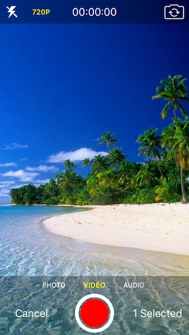
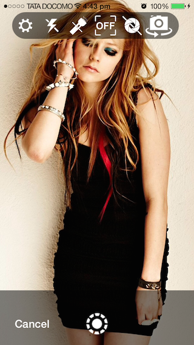

IQMediaPickerController
=======================

   **IQMediaPickerController** allows user to capture **Videos, Images and Audio** using **AVFoundation** framework. It also allows user to pick **Videos, Images and Audio** from the iPhone photo and media library.

   **IQMediaPickerController** contains 3 library **IQMediaCaptureController, IQAssetsPickerController & IQAudioPickerController**. All libraries are separate from the others, so if you want to integrate any one of them, you can copy only required library without copying others.

IQMediaCaptureController
-----------------------
   IQMediaCaptureController is used to capture multiple images, videos and audio.

[]
[]
[]

IQAssetsPickerController
-----------------------
  IQAssetsPickerController is used to pick multiple images & videos from the iPhone photo gallery.

[]

IQAudioPickerController
-----------------------
  IQAudioPickerController is used to pick multiple audio files from the iPhone music library.

[]

## Feature:-

 1) Allows user to capture 3 types of media.
 
 2) Allows user to pick 3 types of media.

 3) Allows picking or capturing multiple media files at once.

LICENSE
---
Distributed under the MIT License.

Contributions
---
Any contribution is more than welcome! You can contribute through pull requests and issues on GitHub.

Author
---
If you wish to contact me, email at: hack.iftekhar@gmail.com

