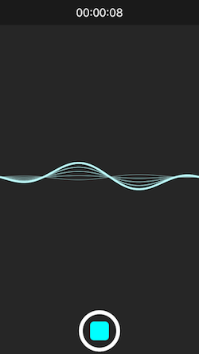
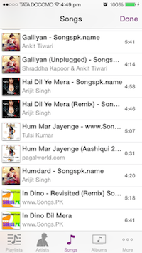

<p align="center">
  
</p>
<H1 align="center">IQMediaPickerController</H1>
<p align="center">
  


   **IQMediaPickerController** allows user to capture **Videos, Images and Audio** using **AVFoundation** framework. It also allows user to pick **Videos, Images and Audio** from the iPhone photo and media library.
   **IQMediaPickerController** contains 3 library **IQMediaCaptureController, IQAssetsPickerController & IQAudioPickerController**. All libraries are separate from the others, so if you want to integrate any one of them, you can copy only required library without copying others.

#### Key Features
- Contains 3 library allows to pick video, photo, audio type of data
- Can capture/record supported data and can pick from photo and audio library as well
- Can record multiple type of data at one shoot
- Can pick or capture/record multiple files at once
- Can limit length of media while recording


IQMediaCaptureController
-----------------------
   IQMediaCaptureController is used to capture multiple images, videos and audio.




IQAssetsPickerController
-----------------------
  IQAssetsPickerController is used to pick multiple images & videos from the iPhone photo gallery.

[]

IQAudioPickerController
-----------------------
  IQAudioPickerController is used to pick multiple audio files from the iPhone music library.

[]

Installation
==========================

#### CocoaPods:-

[](http://cocoadocs.org/docsets/IQMediaPickerController)

***IQMediaPickerController:-*** IQMediaPickerController is available through [CocoaPods](http://cocoapods.org), to install
it simply add the following line to your Podfile:

`pod 'IQMediaPickerController'`

#### Carthage

[Carthage](https://github.com/Carthage/Carthage) is a decentralized dependency manager that builds your dependencies and provides you with binary frameworks.

You can install Carthage with [Homebrew](http://brew.sh/) using the following command:

```bash
$ brew update
$ brew install carthage
```

To integrate `IQMediaPickerController` into your Xcode project using Carthage, specify it in your `Cartfile`:

```ogdl
github "hackiftekhar/IQMediaPickerController"
```

Run `carthage` to build the frameworks and drag `IQMediaPickerController.framework` into your Xcode project.


#### Source Code:-

[]()

Just ***drag and drop*** `IQMediaPickerController` directory to your project. That's it.

Example Usage
==========================

```objc
#import <IQMediaPickerController/IQMediaPickerController.h>

@interface ViewController ()<IQMediaPickerControllerDelegate>
@end

@implementation ViewController
{
    IQMediaPickerSelection *selectedMedias;
}

-(void)showMediaPicker
{
    IQMediaPickerController *controller = [[IQMediaPickerController alloc] init];
    controller.delegate = self;
    
    //Set additional settings if you would like to
    //[controller setSourceType:IQMediaPickerControllerSourceTypeCameraMicrophone];//or IQMediaPickerControllerSourceTypeLibrary
    //[controller setMediaTypes:@[@(PHAssetMediaTypeAudio),@(PHAssetMediaTypeVideo),@(PHAssetMediaTypeImage)]];
    //controller.captureDevice = AVCaptureDevicePositionBack;//or AVCaptureDevicePositionFront
    //controller.allowsPickingMultipleItems = YES;//or NO
    //controller.allowedVideoQualities = @[@(AVCaptureSessionPreset1920x1080),@(AVCaptureSessionPresetHigh)];

    [self presentViewController:controller animated:YES completion:nil];
}

-(void)mediaPickerController:(IQMediaPickerController *)controller didFinishMedias:(IQMediaPickerSelection *)selection
{
    NSLog(@"Info: %@",selection);   //Here you'll get the information about captured or picked assets

    selectedMedias = selection;

    [self.tableView reloadData];
}

- (void)mediaPickerControllerDidCancel:(IQMediaPickerController *)controller;
{
}

@end
```


LICENSE
---
Distributed under the MIT License.

Contributions
---
Any contribution is more than welcome! You can contribute through pull requests and issues on GitHub.

Author
---
If you wish to contact me, email at: hack.iftekhar@gmail.com
